# sikuli-go [](https://github.com/smysnk/SikuliGO/actions/workflows/go-test.yml) [](https://github.com/smysnk/SikuliGO/actions/workflows/go-test.yml) [](https://pypi.org/project/sikuli-go/) [](https://www.npmjs.com/package/@sikuligo/sikuli-go)
<!-- DOCS_CANONICAL_TARGET: docs/downloads/index.md -->
<!-- DOCS_CANONICAL_TARGET: docs/getting-started/index.md -->
<!-- DOCS_SOURCE_MAP: docs/strategy/documentation-source-map.md -->
<!-- DOCS_WORKFLOW: docs/contribution/docs-workflow.md -->


Sikuli is an open-source tool for automating anything visible on a computer screen using image recognition. Instead of relying on internal source code or object IDs, it identifies and interacts with graphical user interface (GUI) components (buttons, text boxes, etc.) by using screenshots. **This repo houses a GoLang port of the original concept.**

Docs: [smysnk.github.io/sikuli-go](https://smysnk.github.io/sikuli-go/)

## Project Intent

- Build a feature-complete GoLang port of the core [Sikuli](https://sikulix.github.io/) concepts.
- Preserve behavioral parity (image matching, regions, patterns, finder semantics).
- Provide a modern, testable architecture with explicit contracts and deterministic matching behavior.
- Establish a maintainable foundation for cross-platform automation features.

## Examples

### Node.js

Scaffold and run Node.js examples:

```bash
yarn dlx @sikuligo/sikuli-go init:js-examples
cd sikuli-go-demo
yarn node examples/click.mjs
```
`init:js-examples` prompts for a target directory, scaffolds a `package.json` with the latest `@sikuligo/sikuli-go` dependency, runs `yarn install`, and copies `.mjs` examples into `examples/`.

```js
import { Screen, Pattern } from "@sikuligo/sikuli-go";

const screen = await Screen();
try {
  const match = await screen.click(Pattern("assets/pattern.png").exact());
  console.log(`clicked match target at (${match.targetX}, ${match.targetY})`);
} finally {
  await screen.close();
}
```

### Python

Scaffold and run Python examples:

```bash
pipx run sikuli-go init:py-examples
cd sikuli-go-demo
python3 examples/click.py
```

`init:py-examples` prompts for a target directory, writes `requirements.txt`, creates `.venv`, installs dependencies, and copies Python examples into `examples/`.
The PyPI package name is `sikuli-go`, while the Python import module remains `sikuligo`.

```python
from sikuligo import Pattern, Screen

screen = Screen()
try:
    match = screen.click(Pattern("assets/pattern.png").exact())
    print(f"clicked match target at ({match.target_x}, {match.target_y})")
finally:
    screen.close()
```

## API Dashboard

`sikuli-go` is the automation runtime. It starts the gRPC API and, when admin endpoints are enabled, serves the live dashboard for the same process.
Use it when clients need to execute automation, OCR, image matching, clicks, typing, or app control.

`sikuli-go-monitor` is the HTTP-only monitor. It reads the shared `sikuli-go.db` session store and serves the dashboard/session viewer without starting another automation server.
Use it when you only want operational visibility: review API sessions, inspect client interactions, or watch a shared session store from another terminal or machine without binding a second gRPC server.

Launch the API and dashboard locally:

```bash
yarn dlx @sikuligo/sikuli-go -listen
```

`-listen` by itself starts the gRPC API on `:50051` and the admin/dashboard server on `:8080`.


Launch the standalone monitor after installing the binaries on PATH:

```bash
sikuli-go-monitor
```

By default it serves the monitor UI on `:8080` and reads `sikuli-go.db` from the current working directory.


## Install API Binary On PATH

Install via Yarn (Node ecosystem):

```bash
yarn dlx @sikuligo/sikuli-go install-binary
```

Install via Python:

```bash
pipx run sikuli-go install-binary
```

Both commands create `~/.local/bin` if needed, copy `sikuli-go` and `sikuli-go-monitor`, and can prompt to add PATH to `~/.zshrc` or `~/.bash_profile`.
If PATH is updated, reload with `source ~/.zshrc` or `source ~/.bash_profile`.

## Available Clients

| Client |  | Notes |
| :---  | --- | :---  |
| [Python](https://pypi.org/project/sikuli-go/)  | ✅ | Implemented |
| [Node](https://www.npmjs.com/package/@sikuligo/sikuli-go)  | ✅ | Implemented |
| Lua  | ✅ | Implemented |
| Robot Framework | 🟡 | Planned |
| Web IDE | 🟡 | Planned |


## Current Focus

| Roadmap Item | Scope |  |
| :---  | :---  |---|
| Core API scaffolding | Public SikuliGo API surface and parity-facing core objects | ✅ |
| Matching engine and parity harness | Deterministic matcher behavior, golden corpus, backend conformance tests | ✅ |
| API parity surface expansion | Additional parity helpers and compatibility APIs | ✅ |
| Protocol completeness hardening | Alternate matcher backend + cross-backend conformance rules | ✅ |
| OCR and text-search parity | OCR contracts, finder/region text flows, optional backend integration | ✅ |
| Input automation and hotkey parity | Input controller contracts, request validation, backend protocol scaffold | 🟡 |
| Observe/event subsystem parity | Observer contracts, request validation, backend protocol scaffold | ✅ |
| App/window/process control parity | App/window contracts, request validation, backend protocol scaffold | ✅ |
| Cross-platform backend hardening | Platform integration hardening and backend portability | 🟡 |

# Docs
- [Docs Home](https://smysnk.github.io/sikuli-go/)

## Repository Layout

- [`pkg`](pkg) : public GoLang API packages
- [`packages/api`](packages/api) : GoLang API module (`cmd`, `internal`, `pkg`, `proto`)
- [`packages/editor`](packages/editor) : Next.js editor app
- [`packages/api-electron`](packages/api-electron) : macOS Electron API + dashboard/session viewer app
- [`packages/client-node`](packages/client-node) : Node.js client SDK and packaging artifacts
- [`packages/client-python`](packages/client-python) : Python client SDK and packaging artifacts
- [`packages/client-lua`](packages/client-lua) : Lua client descriptor/runtime artifacts
- [`docs`](docs) : documentation and assets
- [`legacy`](legacy) : previous Java-era project directories retained for reference

## Install and Build

Build from source:

- [Build From Source](docs/guides/build-from-source.md)

## Project History and Credits

Sikuli started in 2009 as an open-source research effort at the MIT User Interface Design Group, led by **Tsung-Hsiang Chang** and **Tom Yeh**, with early development connected to **Prof. Rob Miller**'s work at **MIT CSAIL**. The project introduced a practical idea that was unusual at the time: instead of relying on internal application APIs, users could automate **Graphical User Interfaces (GUI)** by teaching scripts what to click through screenshots of buttons, icons, and other visual elements. Even the name reflected that vision, drawing from the Huichol concept of the "**God's Eye**," a symbol of seeing and understanding what is otherwise hidden.

In 2012, after the original creators moved on, the project's active development continued under **RaiMan** and evolved into **SikuliX**. That branch carried the platform forward for real-world desktop and web automation, using scripting ecosystems such as **Jython/Python**, **Java**, and **Ruby**, and refining image-based interaction workflows over time. Because this style of automation simulates real **mouse** and **keyboard** behavior, it has always worked best in environments with an active graphical session rather than truly **headless** execution.

The GoLang port in this repository began in **2026**. It stands on the work of the original Sikuli authors, **RaiMan**, and the broader contributor community that kept visual automation practical and accessible over the years.

## Sikuli References

- [SikuliX Official Site](https://sikulix.github.io/)
- [Wikipedia](https://de.wikipedia.org/wiki/Sikuli_(Software))
- [Original Sikuli Github](https://github.com/sikuli/sikuli)
- [Sikuli Framework](https://github.com/smysnk/sikuli-framework) = Sikuli + Robot Framework

<!-- BEGIN: FIND_ON_SCREEN_BENCH_AUTOGEN -->
## FindOnScreen Benchmark Test Results

Generated: `2026-03-07T23:32:15.506029+00:00`

### Reports

- [Markdown Summary](docs/bench/reports/find-on-screen-e2e.md)
- [JSON Report](docs/bench/reports/find-on-screen-e2e.json)
- [Raw go test Output](docs/bench/reports/find-on-screen-e2e.txt)
- [Performance SVG](docs/bench/reports/find-on-screen-performance.svg)
- [Accuracy SVG](docs/bench/reports/find-on-screen-accuracy.svg)
- [Scenario Kind Match Time SVG](docs/bench/reports/find-on-screen-kind-time.svg)
- [Scenario Kind Success SVG](docs/bench/reports/find-on-screen-kind-success.svg)
- [Resolution Match Time SVG](docs/bench/reports/find-on-screen-resolution-time.svg)
- [Resolution Matches SVG](docs/bench/reports/find-on-screen-resolution-matches.svg)
- [Resolution Misses SVG](docs/bench/reports/find-on-screen-resolution-misses.svg)
- [Resolution False Positives SVG](docs/bench/reports/find-on-screen-resolution-false-positives.svg)

### Engine Summary

_Cases/OK metrics are query-level counts (regions x scenarios x resolutions), not just benchmark row count._

| Engine | Cases | OK | Partial | Not Found | Unsupported | Error | Overlap Miss | Avg ms/op | Median ms/op |
|---|---:|---:|---:|---:|---:|---:|---:|---:|---:|
| akaze | 120 | 39 | 0 | 78 | 0 | 0 | 3 | 172.121 | 147.695 |
| brisk | 120 | 47 | 0 | 63 | 0 | 0 | 10 | 388.483 | 123.118 |
| hybrid | 120 | 69 | 0 | 45 | 0 | 0 | 6 | 171.017 | 134.411 |
| kaze | 120 | 63 | 0 | 50 | 0 | 0 | 7 | 824.898 | 640.512 |
| orb | 120 | 13 | 0 | 96 | 0 | 0 | 11 | 56.443 | 44.794 |
| sift | 120 | 56 | 0 | 55 | 0 | 0 | 9 | 256.756 | 198.264 |
| template | 120 | 64 | 0 | 56 | 0 | 0 | 0 | 154.257 | 114.466 |

### Run Mega Summary

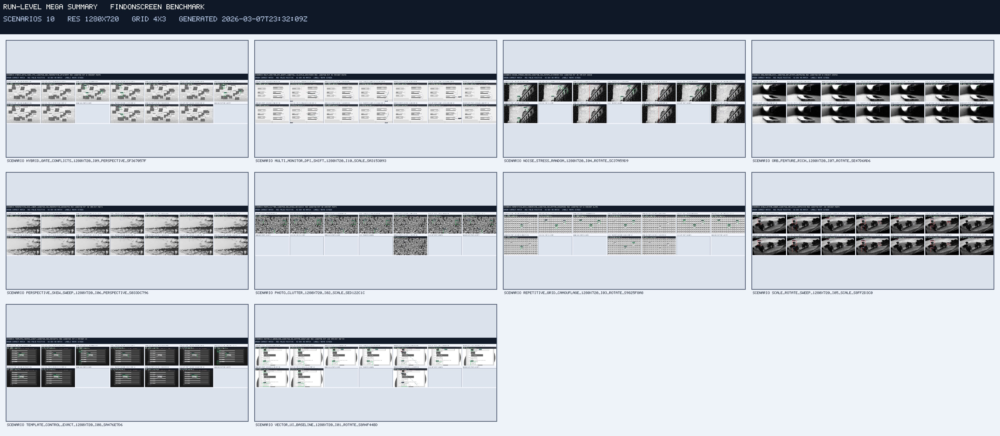

- [Open run mega summary image](docs/bench/reports/visuals/summaries/summary-run-mega.jpg)

### Benchmark Graphs


- [Open performance graph](docs/bench/reports/find-on-screen-performance.svg)

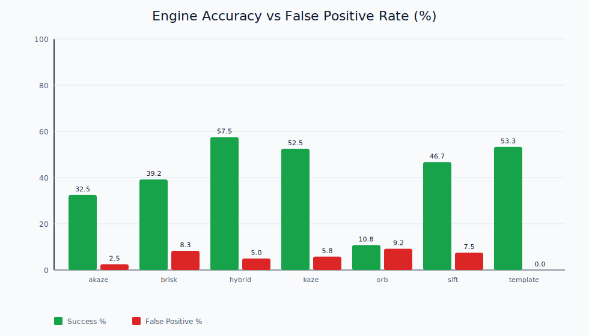

- [Open accuracy graph](docs/bench/reports/find-on-screen-accuracy.svg)

### Scenario Kind Graphs


- [Open scenario kind match time graph](docs/bench/reports/find-on-screen-kind-time.svg)

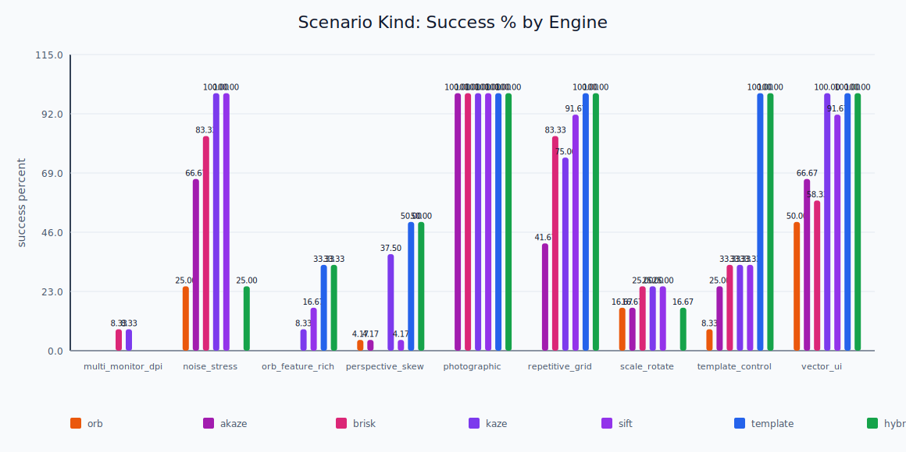

- [Open scenario kind success graph](docs/bench/reports/find-on-screen-kind-success.svg)

### Resolution Group Graphs

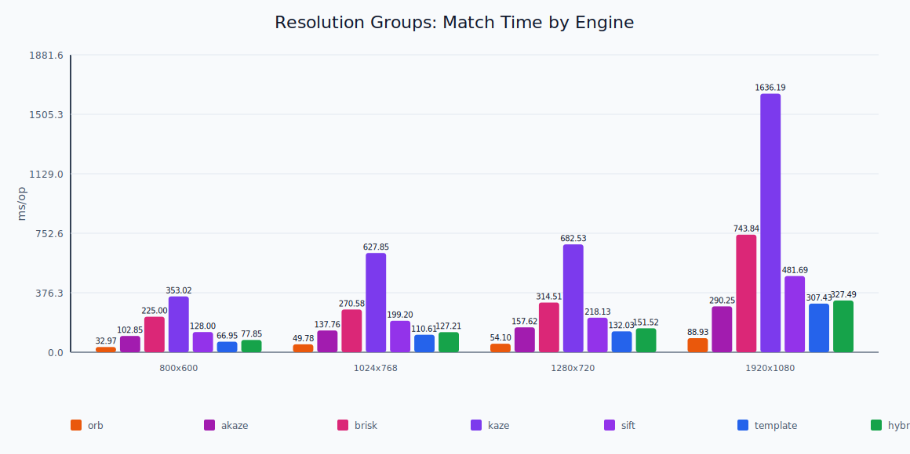

- [Open resolution match time graph](docs/bench/reports/find-on-screen-resolution-time.svg)


- [Open resolution matches graph](docs/bench/reports/find-on-screen-resolution-matches.svg)


- [Open resolution misses graph](docs/bench/reports/find-on-screen-resolution-misses.svg)

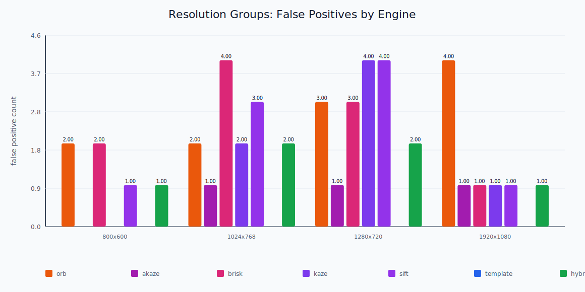

- [Open resolution false positives graph](docs/bench/reports/find-on-screen-resolution-false-positives.svg)

### Artifact Directories

- [Visual Root](docs/bench/reports/visuals/)
- [Scenario Summaries](docs/bench/reports/visuals/summaries/)

### Scenario Summary Images (10)

#### `hybrid_gate_conflicts_1920x1080_i09`

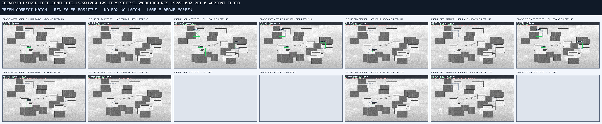

- [Open `hybrid_gate_conflicts_1920x1080_i09` image](docs/bench/reports/visuals/summaries/summary-hybrid_gate_conflicts_1920x1080_i09.png)

#### `multi_monitor_dpi_shift_1920x1080_i10`

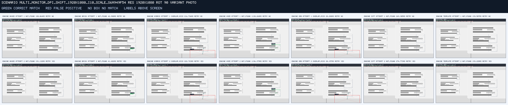

- [Open `multi_monitor_dpi_shift_1920x1080_i10` image](docs/bench/reports/visuals/summaries/summary-multi_monitor_dpi_shift_1920x1080_i10.png)

#### `noise_stress_random_1920x1080_i04`

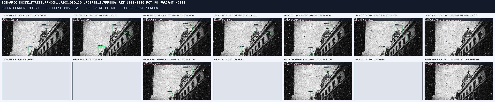

- [Open `noise_stress_random_1920x1080_i04` image](docs/bench/reports/visuals/summaries/summary-noise_stress_random_1920x1080_i04.png)

#### `orb_feature_rich_1920x1080_i07`

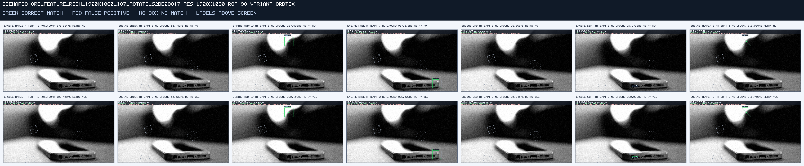

- [Open `orb_feature_rich_1920x1080_i07` image](docs/bench/reports/visuals/summaries/summary-orb_feature_rich_1920x1080_i07.png)

#### `perspective_skew_sweep_1920x1080_i06`

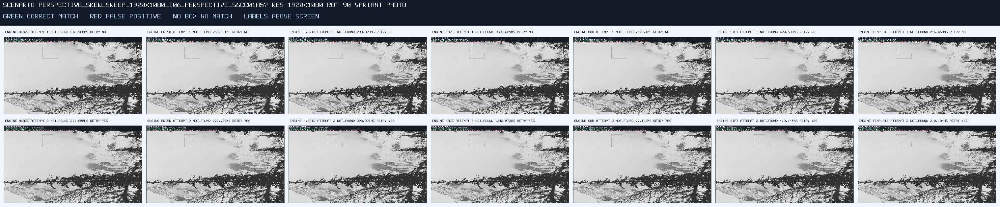

- [Open `perspective_skew_sweep_1920x1080_i06` image](docs/bench/reports/visuals/summaries/summary-perspective_skew_sweep_1920x1080_i06.png)

#### `photo_clutter_1920x1080_i02`

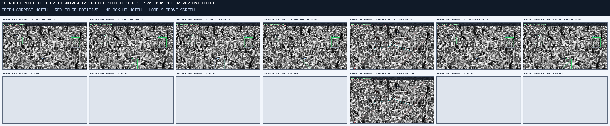

- [Open `photo_clutter_1920x1080_i02` image](docs/bench/reports/visuals/summaries/summary-photo_clutter_1920x1080_i02.png)

#### `repetitive_grid_camouflage_1920x1080_i03`

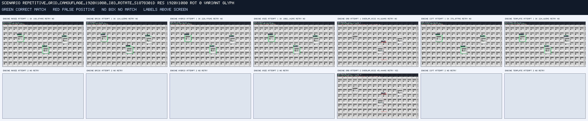

- [Open `repetitive_grid_camouflage_1920x1080_i03` image](docs/bench/reports/visuals/summaries/summary-repetitive_grid_camouflage_1920x1080_i03.png)

#### `scale_rotate_sweep_1920x1080_i05`

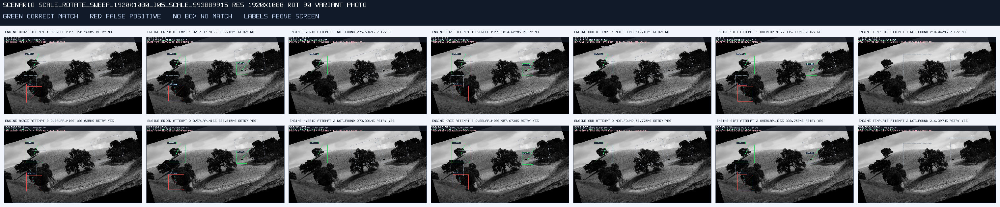

- [Open `scale_rotate_sweep_1920x1080_i05` image](docs/bench/reports/visuals/summaries/summary-scale_rotate_sweep_1920x1080_i05.png)

#### `template_control_exact_1920x1080_i08`

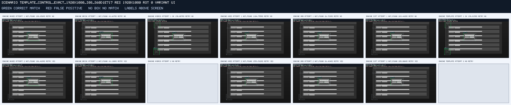

- [Open `template_control_exact_1920x1080_i08` image](docs/bench/reports/visuals/summaries/summary-template_control_exact_1920x1080_i08.png)

#### `vector_ui_baseline_1920x1080_i01`

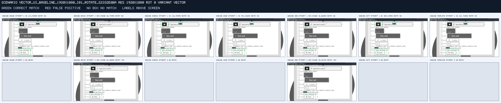

- [Open `vector_ui_baseline_1920x1080_i01` image](docs/bench/reports/visuals/summaries/summary-vector_ui_baseline_1920x1080_i01.png)

<!-- END: FIND_ON_SCREEN_BENCH_AUTOGEN -->
