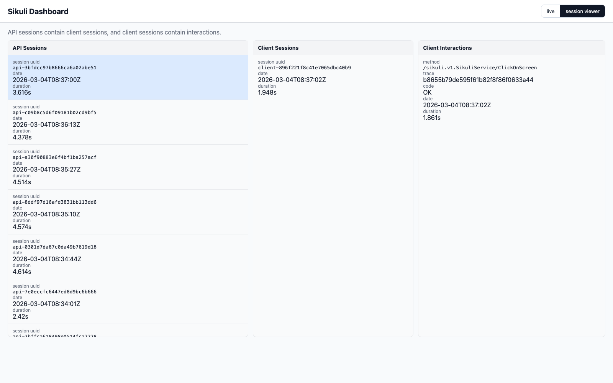

# sikuli-go (Node.js)

sikuli-go is a Go implementation of Sikuli visual automation. This package provides the Node.js SDK for launching `sikuli-go` locally and executing automation with a small API surface.

## Links

- Main repository: [github.com/smysnk/SikuliGO](https://github.com/smysnk/SikuliGO)
- API reference: [smysnk.github.io/sikuli-go/reference/api](https://smysnk.github.io/sikuli-go/reference/api/)
- Node user flow: [smysnk.github.io/sikuli-go/guides/node-package-user-flow](https://smysnk.github.io/sikuli-go/guides/node-package-user-flow)
- Client strategy: [smysnk.github.io/sikuli-go/strategy/client-strategy](https://smysnk.github.io/sikuli-go/strategy/client-strategy)
- Architecture docs: [Port Strategy](https://smysnk.github.io/sikuli-go/strategy/port-strategy), [gRPC Strategy](https://smysnk.github.io/sikuli-go/strategy/grpc-strategy), [Java Parity Map](https://smysnk.github.io/sikuli-go/reference/parity/java-to-go-mapping)

## Quickstart

`init:js-examples` prompts for a target directory, scaffolds a `package.json` with the latest `@sikuligo/sikuli-go` dependency, runs `yarn install`, and copies `.mjs` examples into `examples/`.

```bash
yarn dlx @sikuligo/sikuli-go init:js-examples
cd sikuli-go-demo
yarn node examples/click.mjs
```

```js
import { Screen, Pattern } from "@sikuligo/sikuli-go";

const screen = await Screen();
try {
  const match = await screen.click(Pattern("assets/pattern.png").exact());
  console.log(`clicked match target at (${match.targetX}, ${match.targetY})`);
} finally {
  await screen.close();
}
```

## Web Dashboard

`sikuli-go` runs the automation API. Use it when Node code needs to execute automation and you want live admin endpoints from the same process.
This is the binary your scripts talk to for screen search, OCR, input, and application control.

`sikuli-go-monitor` is the HTTP-only session viewer. Use it to inspect the shared `sikuli-go.db` store without starting another gRPC automation server.
It is useful when automation is already running elsewhere and you only want to observe sessions, review interaction history, or leave a lightweight monitor process running beside your Node workflow.

```bash
yarn dlx @sikuligo/sikuli-go -listen
```

Open:

- http://127.0.0.1:8080/dashboard

`-listen` by itself starts the gRPC API on `:50051` and the admin/dashboard server on `:8080`.

After installing the binaries on PATH, launch the standalone monitor with:

```bash
sikuli-go-monitor
```

By default it serves the monitor UI on `:8080` and reads `sikuli-go.db` from the current working directory.



Additional endpoints:

- http://127.0.0.1:8080/healthz
- http://127.0.0.1:8080/metrics
- http://127.0.0.1:8080/snapshot

Install permanently on PATH:

```bash
yarn dlx @sikuligo/sikuli-go install-binary
source ~/.zshrc
# or
source ~/.bash_profile
```

<!-- BEGIN: FIND_ON_SCREEN_BENCH_AUTOGEN -->
## FindOnScreen Benchmark Test Results

Generated: `2026-03-07T23:32:15.506029+00:00`

### Reports

- [Markdown Summary](https://smysnk.github.io/sikuli-go/bench/reports/find-on-screen-e2e.md)
- [JSON Report](https://smysnk.github.io/sikuli-go/bench/reports/find-on-screen-e2e.json)
- [Raw go test Output](https://smysnk.github.io/sikuli-go/bench/reports/find-on-screen-e2e.txt)
- [Performance SVG](https://smysnk.github.io/sikuli-go/bench/reports/find-on-screen-performance.svg)
- [Accuracy SVG](https://smysnk.github.io/sikuli-go/bench/reports/find-on-screen-accuracy.svg)
- [Scenario Kind Match Time SVG](https://smysnk.github.io/sikuli-go/bench/reports/find-on-screen-kind-time.svg)
- [Scenario Kind Success SVG](https://smysnk.github.io/sikuli-go/bench/reports/find-on-screen-kind-success.svg)
- [Resolution Match Time SVG](https://smysnk.github.io/sikuli-go/bench/reports/find-on-screen-resolution-time.svg)
- [Resolution Matches SVG](https://smysnk.github.io/sikuli-go/bench/reports/find-on-screen-resolution-matches.svg)
- [Resolution Misses SVG](https://smysnk.github.io/sikuli-go/bench/reports/find-on-screen-resolution-misses.svg)
- [Resolution False Positives SVG](https://smysnk.github.io/sikuli-go/bench/reports/find-on-screen-resolution-false-positives.svg)

### Engine Summary

_Cases/OK metrics are query-level counts (regions x scenarios x resolutions), not just benchmark row count._

| Engine | Cases | OK | Partial | Not Found | Unsupported | Error | Overlap Miss | Avg ms/op | Median ms/op |
|---|---:|---:|---:|---:|---:|---:|---:|---:|---:|
| akaze | 120 | 39 | 0 | 78 | 0 | 0 | 3 | 172.121 | 147.695 |
| brisk | 120 | 47 | 0 | 63 | 0 | 0 | 10 | 388.483 | 123.118 |
| hybrid | 120 | 69 | 0 | 45 | 0 | 0 | 6 | 171.017 | 134.411 |
| kaze | 120 | 63 | 0 | 50 | 0 | 0 | 7 | 824.898 | 640.512 |
| orb | 120 | 13 | 0 | 96 | 0 | 0 | 11 | 56.443 | 44.794 |
| sift | 120 | 56 | 0 | 55 | 0 | 0 | 9 | 256.756 | 198.264 |
| template | 120 | 64 | 0 | 56 | 0 | 0 | 0 | 154.257 | 114.466 |

### Run Mega Summary


- [Open run mega summary image](https://smysnk.github.io/sikuli-go/bench/reports/visuals/summaries/summary-run-mega.jpg)

### Benchmark Graphs


- [Open performance graph](https://smysnk.github.io/sikuli-go/bench/reports/find-on-screen-performance.svg)


- [Open accuracy graph](https://smysnk.github.io/sikuli-go/bench/reports/find-on-screen-accuracy.svg)

### Scenario Kind Graphs


- [Open scenario kind match time graph](https://smysnk.github.io/sikuli-go/bench/reports/find-on-screen-kind-time.svg)


- [Open scenario kind success graph](https://smysnk.github.io/sikuli-go/bench/reports/find-on-screen-kind-success.svg)

### Resolution Group Graphs


- [Open resolution match time graph](https://smysnk.github.io/sikuli-go/bench/reports/find-on-screen-resolution-time.svg)


- [Open resolution matches graph](https://smysnk.github.io/sikuli-go/bench/reports/find-on-screen-resolution-matches.svg)


- [Open resolution misses graph](https://smysnk.github.io/sikuli-go/bench/reports/find-on-screen-resolution-misses.svg)


- [Open resolution false positives graph](https://smysnk.github.io/sikuli-go/bench/reports/find-on-screen-resolution-false-positives.svg)

### Artifact Directories

- [Visual Root](https://smysnk.github.io/sikuli-go/bench/reports/visuals/index.html)
- [Scenario Summaries](https://smysnk.github.io/sikuli-go/bench/reports/visuals/summaries/index.html)
- [Attempt Images](https://smysnk.github.io/sikuli-go/bench/reports/visuals/attempts/index.html)

### Scenario Summary Images (10)

#### `hybrid_gate_conflicts_1920x1080_i09`


- [Open `hybrid_gate_conflicts_1920x1080_i09` image](https://smysnk.github.io/sikuli-go/bench/reports/visuals/summaries/summary-hybrid_gate_conflicts_1920x1080_i09.png)

#### `multi_monitor_dpi_shift_1920x1080_i10`


- [Open `multi_monitor_dpi_shift_1920x1080_i10` image](https://smysnk.github.io/sikuli-go/bench/reports/visuals/summaries/summary-multi_monitor_dpi_shift_1920x1080_i10.png)

#### `noise_stress_random_1920x1080_i04`


- [Open `noise_stress_random_1920x1080_i04` image](https://smysnk.github.io/sikuli-go/bench/reports/visuals/summaries/summary-noise_stress_random_1920x1080_i04.png)

#### `orb_feature_rich_1920x1080_i07`


- [Open `orb_feature_rich_1920x1080_i07` image](https://smysnk.github.io/sikuli-go/bench/reports/visuals/summaries/summary-orb_feature_rich_1920x1080_i07.png)

#### `perspective_skew_sweep_1920x1080_i06`


- [Open `perspective_skew_sweep_1920x1080_i06` image](https://smysnk.github.io/sikuli-go/bench/reports/visuals/summaries/summary-perspective_skew_sweep_1920x1080_i06.png)

#### `photo_clutter_1920x1080_i02`


- [Open `photo_clutter_1920x1080_i02` image](https://smysnk.github.io/sikuli-go/bench/reports/visuals/summaries/summary-photo_clutter_1920x1080_i02.png)

#### `repetitive_grid_camouflage_1920x1080_i03`


- [Open `repetitive_grid_camouflage_1920x1080_i03` image](https://smysnk.github.io/sikuli-go/bench/reports/visuals/summaries/summary-repetitive_grid_camouflage_1920x1080_i03.png)

#### `scale_rotate_sweep_1920x1080_i05`


- [Open `scale_rotate_sweep_1920x1080_i05` image](https://smysnk.github.io/sikuli-go/bench/reports/visuals/summaries/summary-scale_rotate_sweep_1920x1080_i05.png)

#### `template_control_exact_1920x1080_i08`


- [Open `template_control_exact_1920x1080_i08` image](https://smysnk.github.io/sikuli-go/bench/reports/visuals/summaries/summary-template_control_exact_1920x1080_i08.png)

#### `vector_ui_baseline_1920x1080_i01`


- [Open `vector_ui_baseline_1920x1080_i01` image](https://smysnk.github.io/sikuli-go/bench/reports/visuals/summaries/summary-vector_ui_baseline_1920x1080_i01.png)

<!-- END: FIND_ON_SCREEN_BENCH_AUTOGEN -->
